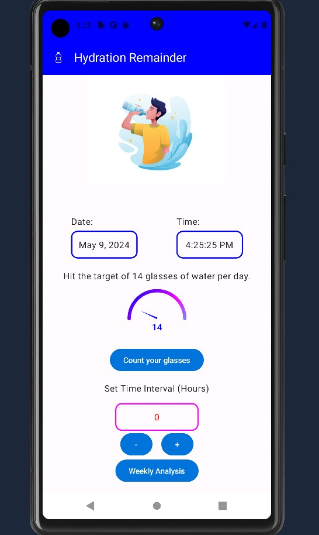
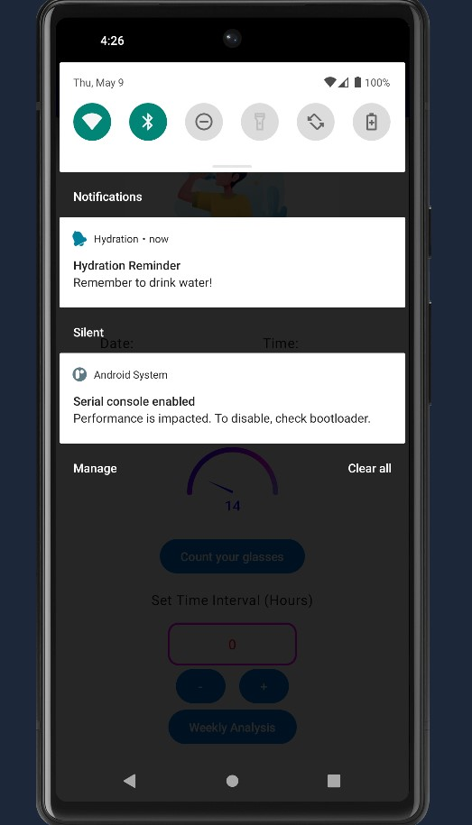
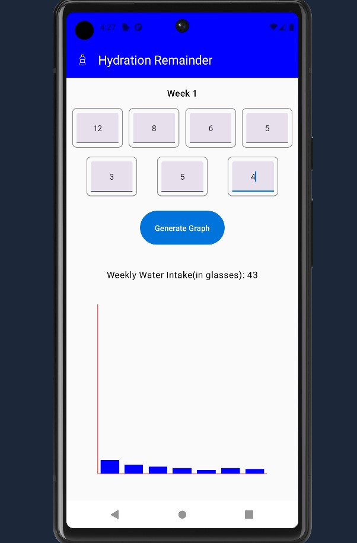

# Hydration Reminder App

The Hydration Reminder App is an Android application designed to help users maintain proper hydration throughout the day by sending regular reminders to drink water.

## Features

- *Reminder Schedule*: The app sends reminders every two hours from 8 AM to 8 PM, encouraging users to drink water regularly. I can be customized on adding one more feature of customization for genral purposes also.
- *User Interaction*: Users can start or stop the hydration reminders through a simple and intuitive interface, providing flexibility based on their daily needs and activities.
- *Notification System*: The app utilizes Android's built-in notification system to alert users at the specified times, with each notification reminding them to drink a glass of water.
- *Local Data Storage*: User settings, such as whether the reminder is active or not, are saved locally on the device, ensuring that the app remembers the user's preferences even after being closed or the device being restarted.

## Figma Design:
 https://www.figma.com/design/TvtXGT7zo5gBHPQMsYBPlk/Untitled?node-id=0%3A1&t=SGAv4jExE1ERkEkB-1

## Additional Features

- *Customizable Reminder Schedule*: Users can set their own reminder intervals (e.g., every hour, every three hours) and start/end times based on their personal hydration needs or lifestyle.

- *Notification Quotes:*

1. "Water is the elixir of life. Drink up!"
2. "Stay hydrated, stay healthy."
3. "Hydrate like it's your job."
4. "Water: nature's best kept secret for health."
5. "Drink water like it's your favorite beverage."
6. "Keep calm and drink water."
7. "Hydration is the key to vitality."
8. "Sip by sip, stay refreshed."
9. "Water: the original energy drink."
10. "Fuel your body with hydration."
11. "Don't forget to hydrate; your body will thank you."
12. "Hydration is the foundation of wellness."
13. "Water: the ultimate pick-me-up."
14. "Every drop counts; drink up!"
15. "Listen to your body; it's thirsty for water."
16. "Hydration is the key to unlocking your full potential."
17. "Water: the magic potion for a healthier you."
18. "Stay hydrated, stay vibrant."
19. "One sip closer to a happier you."
20. "Hydration is self-care in liquid form."
21. "Quench your thirst, fuel your greatness."
22. "Water: the ultimate beauty elixir."
23. "Drink water and be happy."
24. "H2-Oh yeah! Keep those fluids flowing."
25. "A hydrated body is a happy body."
26. "Hydration is the cornerstone of well-being."
27. "Water: your body's best friend."
28. "Sip, hydrate, repeat."
29. "Stay hydrated and conquer the day."
30. "Your body is a temple; hydrate accordingly."

- *Hydration Tracker*: Users can log the amount of water they drink throughout the day, with visual feedback such as graphs or progress bars showing their daily, weekly, or monthly water intake compared to their goals.
- *Hydration Goal Setting*: Users can set daily water intake goals based on their body weight, climate, or activity level, with the app offering recommendations for daily water intake based on these factors.

## Setup and Installation

1. Clone the repository: git clone https://github.com/your-username/hydration-reminder-app.git
2. Open the project in Android Studio.
3. Build and run the app on an emulator or physical device.

## Contributing
Contributions are welcome! If you find any issues or have suggestions for improvements, please open an issue or submit a pull request.

## Demo
https://github.com/arpitpathak16/Hydration/assets/110929773/13fea78a-8e18-4b6b-8156-259b55fdc64d

